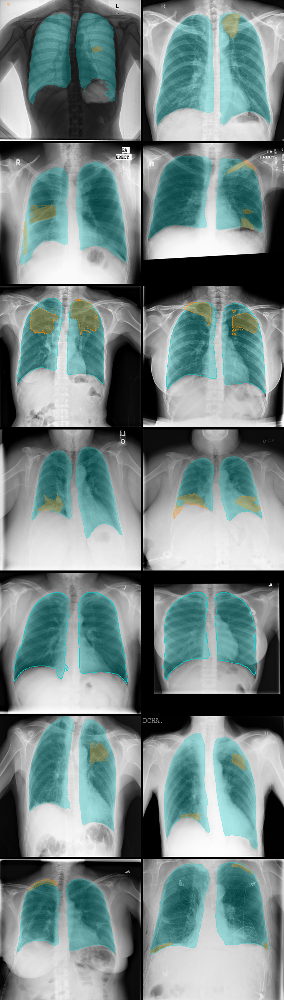

# timika30k_dataset

Reproducibility pipeline for timika-30k: assembles it from 6 source datasets, drives label and pseudo-label generation, and produces 5 preprocessing variants. Renamed 2026-09-04 from timika-50k/timika50k_dataset after dropping COVID-19 Radiography Database, see Status below.



**Documentation**: [DATASHEET.md](DATASHEET.md) (Gebru et al.'s 7-section
format, populated with this project's own real facts, not a template) and
[croissant.json](croissant.json) (MLCommons Croissant metadata, machine-
readable dataset description).

## Reproducibility checklist

Adapted from Papers with Code's ML Code Completeness Checklist (the
NeurIPS 2020 code-submission standard), mapped onto a dataset repo rather
than a model repo:

| Item | Status |
|---|---|
| Dependency spec (`pyproject.toml`) | Done |
| Build code: assembly (phase 2 below) | Done, `src/timika30k_dataset/assembly/build_data.py` |
| Build code: labels/pseudo-labels | Done, in `repo/timika30k_pseudolabels` (called into, not reimplemented here) |
| Build code: preprocessing | 4 of 5 variants done, `analyses/timika30k_preprocessing` + `src/timika30k_dataset/bone_suppression/` + `src/timika30k_dataset/clahe/` |
| Evaluation/QC code | Done: patient-grouped leakage checks, official-split fidelity checks, box-to-mask geometry checks, confirmed-negative source-rule checks, plus embedding-based anomaly detection (`src/timika30k_dataset/anomaly/`) |
| "Pretrained model" equivalent (the finished artifact) | Done, `E:\dataset\timika-30k\` + `dataset/timika-30k/` project copy |
| README with exact reproduction commands | Done, `src/timika30k_dataset/orchestrate.py` + Usage below |
| Results table | N/A, this is a dataset repo, not a results-reporting one; see per-source counts in DATASHEET.md instead |

## Scope, and what already exists elsewhere

Download has no code, by design (see below). Assembly's real code lives in this repo. Labels and preprocessing already have real code in 2 other repos; check there before writing anything new.

- **Download**: the 6 sources (Shenzhen, Montgomery, TBX11K, ChestX-Det, BIMCV-CAAXR, SIIM-ACR Pneumothorax) were each acquired separately over time, heterogeneous source-specific methods (Kaggle API, direct NLM download, an access-gated custom tool, an authorized community rehost); see `dataset/manifest.md`'s per-source rows for how and from where. Not scripted, and likely never will be: 4 different access methods, 1 access-request gate, no single API covers all 6.
- **Assembly** (phase 2, `src/timika30k_dataset/assembly/build_data.py`): the real, scripted gap this repo closes. Takes the 6 sources as already downloaded/canonicalized at `E:\dataset\{name}\` (assumed present, not fetched by this script) and applies timika-30k's own eligibility rule (`dataset/manifest.md`'s timika-30k row): drop TBX11K's own `data/extra/` (bonus augmentation, not part of its core release) and drop any file either source's own `labels/quality_flags.csv.bz2` marks `status=="duplicate"`. `--dry-run` reports per-source counts with no file copy: 662/138/11,490/3,577/2,539/12,088, 30,494 total.
- **Labels / pseudo-labels**: `repo/timika30k_pseudolabels` already generates the disease pseudo-label layer per source group (DS group built, 27,631 files; DB and OS groups blocked on the disease model retrain). Call into that repo, do not reimplement it here.
- **Preprocessing variants**: `analyses/timika30k_preprocessing` already builds one variant, a per-image min/max rescale to 8-bit matching `DiseaseSegDataset`'s own training-time preprocessing, plus `splits_official.csv`/`splits_fair.csv`. The variants below are new, and should reuse its split manifests rather than re-deriving train/val/test membership.

## Usage

`orchestrate.py` runs every phase already scripted, in dependency order,
each via `uv run` inside that phase's own uv project (assembly and
metadata here, labels in `repo/timika30k_pseudolabels`, preprocessing in
`analyses/timika30k_preprocessing` -- 4 separate dependency sets, so this
script shells out rather than importing across them):

```
uv run python -m timika30k_dataset.orchestrate --dry-run
uv run python -m timika30k_dataset.orchestrate
uv run python -m timika30k_dataset.orchestrate --phases assembly,sync_to_project_copy
```

`--dry-run` prints the exact command sequence, runs nothing. `--phases`
restricts to a comma-separated subset of: `assembly`,
`organ_region_labels`, `organ_region_manifest`,
`disease_confirmed_negatives`, `disease_caaxr_box_masks`,
`disease_tb_box_masks`, `disease_ds_group`, `disease_manifest`,
`sync_to_project_copy`, `preprocessing`, `splits`, `view_position`, the
same order a full run uses.

`assembly` through `disease_manifest` (the first 8 phases) read and write
`E:\dataset\timika-30k\`, the canonical copy. `sync_to_project_copy`
mirrors `data/` and `labels/` from there into `dataset/timika-30k/`, this
project's own second copy (`dataset/manifest.md`'s timika-30k row).
`preprocessing`, `splits`, and `view_position` (the last 3 phases) read
and write only that C: copy, never E:, per the 2026-09-02 decision to
keep `preprocessed/` project-local. Every phase script is independently
resumable (an existing output is treated as done and skipped), so
re-running the orchestrator after a partial or complete prior run costs
only the time to check what already exists, not a full rebuild.

## Preprocessing variants to build

1. Raw image: no processing. Already satisfied by `data/` itself, nothing to build.
2. Crop and normalize, no leakage across split: `analyses/timika30k_preprocessing`, done.
3. Bone suppression: done, `src/timika30k_dataset/bone_suppression/`. Ports the vendored Keras ResNet-BS (`external/CXR-bone-suppression`, Rajaraman et al. 2021) to PyTorch, reusing an existing port (`analyses/bone_suppression_sample/pytorch_port/`). Runs directly on the already-512x512 preprocessed image (fully convolutional, no fixed input size despite the original notebook always resizing to 256x256 first), so it needs no geometry of its own for labels to track. 30,494/30,494, `E:\dataset\timika-30k\preprocessed_bone_suppressed\`.
4. Bone suppression + CLAHE: done, `src/timika30k_dataset/clahe/build_bone_suppression_clahe_variant.py`. 30,494/30,494, `E:\dataset\timika-30k\preprocessed_bone_suppression_clahe\`.
5. CLAHE only: done, `src/timika30k_dataset/clahe/build_clahe_variant.py`. `cv2.createCLAHE`, `clip_limit=2.0`/`tile_grid_size=(8,8)` (`clahe/apply.py`'s own docstring has the literature basis, a corroborated range rather than one pinned citation). 30,494/30,494, `E:\dataset\timika-30k\preprocessed_clahe\`.

## Status

All phases are complete and have been run in full, 2026-09-04: assembly,
organ-region labels, disease labels, preprocessing, and all 5
preprocessing variants (raw, crop+normalize, bone suppression,
bone-suppression+CLAHE, CLAHE-only).

- `assembly/build_data.py`: the eligibility filter and copy into `data/`, see Usage.
- `assembly/sync_to_project_copy.py`: mirrors `data/` and `labels/` from the canonical E: copy into this project's own C: copy.
- `orchestrate.py`: runs every phase, across this repo and the 3 others it calls into.
- `anomaly/`: PSPNet/DenseNet embedding extraction, UMAP, Isolation Forest, and HDBSCAN clustering for image-quality QC; not part of the core pipeline.
- `metadata/add_view_position.py`: adds a `view_position` column to `preprocessed/manifest.csv`.
- `bone_suppression/`: PyTorch ResNet-BS (Rajaraman et al. 2021), ported from the vendored Keras model. Runs directly on the 512x512 preprocessed image, no extra resize. Output at `E:\dataset\timika-30k\preprocessed_bone_suppressed\`.
- `label_matching/`: disease labels re-registered onto `preprocessed/`'s 512x512 grid. Real masks are geometrically transformed; SAM/box-derived masks are re-segmented against the bone-suppressed pixels rather than warped, so a stale mask can't carry over bone-edge confounding from before suppression. Output at `E:\dataset\timika-30k\preprocessed_labels\`. `reproducibility_check.py` re-runs SAM (the one label method without a determinism guarantee) on a seeded sample and checks IoU against the saved mask: 20/20 sampled rows across 4 source/method groups land at 0.9996-1.0.
- `clahe/`: the CLAHE and bone-suppression+CLAHE variants.
- `DATASHEET.md`, `croissant.json`: this repo's documentation.
- `samples/build_readme_grid.py`: builds `sample_grid.png` above.

COVID-19 Radiography Database was dropped 2026-09-04: no disease-level
box or mask for any of its 3 abnormal classes, and its labels were never
mapped onto this project's taxonomy, so the drop costs zero disease-class
coverage. This repo was renamed `timika50k_dataset` -> `timika30k_dataset`
to match the dataset's own `timika-50k` -> `timika-30k` rename. Full
rationale: `context/intent.md`'s 2026-09-04 entry.

Open: the disease-label layer covers Shenzhen/ChestX-Det/SIIM-ACR
Pneumothorax (real masks), plus confirmed negatives and box-derived
labels for TBX11K, BIMCV-CAAXR, and Montgomery. About 8,500 images still
need the disease-segmentation model, which remains unusable after 2
failed training runs; a fix (foreground-oversampled batch sampling,
`repo/timika_segmentation_models`) is implemented but not yet run.
